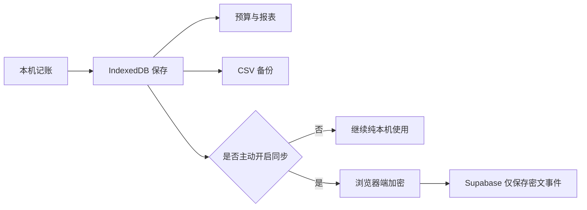
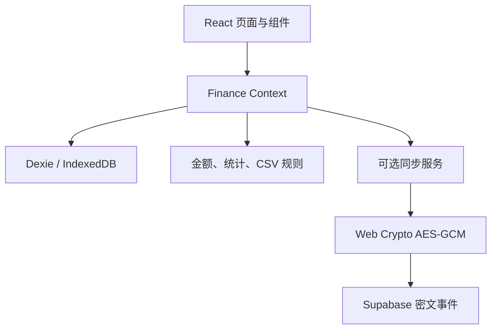

# 零钱簿 · 阿砚

<p align="center">
  
</p>

<p align="center">
  面向中文用户的人民币个人财务手账。默认把账目留在当前浏览器，需要时再由用户主动开启端到端加密同步。
</p>

<p align="center">
  
  
  
  
</p>

## 项目定位

零钱簿解决日常记账、预算和复盘这三件事。它不是投资平台，也不替用户评价消费。账目默认写入浏览器 IndexedDB；没有 Supabase 配置或网络中断时，本机记账仍应正常工作。

阿砚是常驻页面的水墨砚貅账灵。它只根据当前账簿在本机回答问题，语气温和、具体，不冒充专业理财顾问。

## 功能

| 功能 | 当前实现 |
| :--- | :--- |
| 总览 | 本月收入、支出、结余、预算使用率、六个月趋势和最近流水 |
| 流水 | 新增、编辑、删除、搜索，并按月份、类型和分类筛选 |
| 预算 | 按月、按支出分类设置限额，显示剩余与超支状态 |
| 报表 | 十二个月收支趋势、支出分类占比和月度摘要 |
| 数据 | IndexedDB 本机持久化，CSV 预检、去重、导入和导出 |
| 同步 | 用户主动启用的 Supabase 跨设备同步，浏览器端 AES-256-GCM 加密 |
| 阿砚 | 本机回答收支、预算、购买判断和最近流水，可记住用户称呼 |
| 适配 | 桌面侧栏、移动底部导航和快速记账入口 |

## 使用流程



## 数据规则

- 金额在程序和数据库中使用整数“分”，只在输入、展示和 CSV 边界转换成“元”。
- 日期使用本地日历语义，CSV 固定为 `YYYY-MM-DD`。
- CSV 表头固定为 `日期,类型,分类,金额,备注`。
- 类型只能是 `收入` 或 `支出`。
- CSV 导入先预检，再由用户确认；非法行和重复项不会静默写入。
- 导出包含 UTF-8 BOM，可直接用 Excel 打开中文内容。

示例：

```csv
日期,类型,分类,金额,备注
2026-08-01,支出,餐饮,18.50,午餐
```

## 隐私边界

- 未开启同步时，财务数据只保存在当前浏览器的 IndexedDB 中。
- 开启同步后，同步事件先在浏览器端加密；解密密钥不写入远端数据库。
- 配对二维码和链接等同于账簿钥匙，不应截图公开或提交到仓库。
- `.env.local`、真实密钥、生产配对材料、旧部署包和本地工作目录均不纳入版本库。
- 阿砚的问答在页面内计算，不调用云端模型。

## 快速开始

需要 Node.js 20 或更高版本。

```powershell
npm.cmd install
npm.cmd run dev
```

生产构建与本地预览：

```powershell
npm.cmd run build
npm.cmd run preview
```

自动化测试：

```powershell
npm.cmd test
```

## 可选同步配置

1. 新建 Supabase 项目。
2. 在 SQL Editor 中完整执行 [`supabase/schema.sql`](./supabase/schema.sql)。
3. 在 Authentication 设置中开启 Anonymous Sign-Ins。
4. 复制 `.env.example` 为 `.env.local`，填写项目 URL 和 Publishable Key。
5. 重新构建并通过 HTTPS 站点访问。

```env
VITE_SUPABASE_URL=https://your-project.supabase.co
VITE_SUPABASE_PUBLISHABLE_KEY=sb_publishable_your_key
```

同步属于可选能力。没有配置、服务不可用或网络中断时，不应阻塞本机记账。

## 技术栈与结构

| 路径 | 职责 |
| :--- | :--- |
| `src/lib/` | 金额、统计、CSV 与阿砚逻辑 |
| `src/data/` | Dexie 数据库与默认分类 |
| `src/sync/` | 加密、配对、同步协议与远端传输 |
| `src/context/` | 本机数据和同步状态协调 |
| `src/components/` | 可复用展示组件 |
| `supabase/` | 数据库 schema、函数和 RLS 策略 |
| `MEMORY/` | 当前事实、决策与待办 |
| `docs/` | 项目说明、项目志、质量门禁与发布记录 |



## 当前状态

2026-08-11 在本仓库完成 1.0.3 测试稳定性与治理一致性收尾：

- `npm.cmd ci --offline` 成功，未联网安装依赖；npm 审计报告 0 个已知漏洞。
- `npm.cmd test`：8 个测试文件、42 项测试通过。
- `npm.cmd run build`：TypeScript 检查和 Vite 生产构建通过。
- 报表语义表格测试不再初始化 Recharts 布局，并拆分为总览与懒加载报表两个独立用例；紧缩至 500ms 的反馈循环连续三轮通过，未再出现 jsdom 图表尺寸警告。
- 1.0.3 实际 ZIP 已在 1440×900 桌面端和 375×812 隔离移动端完成页面、报表懒加载、弹窗边界与横向溢出检查；控制台 0 warning、0 error。
- 已覆盖 IndexedDB 首次建库与 v1→v2 升级、CSV 事务回滚、错误密钥、损坏密文、唯一 IV、重复事件、离线队列和流水冲突收敛。
- 已覆盖流水编辑删除、预算新增编辑删除、自定义分类依赖、清空数据、CSV 错误恢复及相应同步事件。
- 图表仅在进入报表时加载；两张实际加载的 WebP 水墨素材合计约 223 kB，原 PNG 保留为源素材。
- 弹窗支持自动聚焦、Tab 焦点圈定、Escape 关闭和焦点归还；图表提供可读数值表，高对比模式不只依赖颜色。
- 当前 `supabase/schema.sql` 已在本机 PostgreSQL 和每月 0 美元的独立 Supabase 项目完成 RLS 对抗测试；云端测试数据已清理，测试项目已暂停，旧项目未改动。
- GitHub 已公开 1.0.2 基线提交 `c840eee`；本地 1.0.3 改动尚未提交、推送或建立标签。
- 1.0.3 Cloudflare Pages 直传候选 ZIP 已生成并完成结构、哈希与隔离浏览器验收，记录见 [`docs/发布候选记录-1.0.3.md`](./docs/发布候选记录-1.0.3.md)；尚未部署。
- 当前仓库没有生产环境变量、配对凭证或真实财务数据。
- 线上双设备同步和当前版本的生产部署尚未在本仓库重新验收。

详细状态见 [`MEMORY/事实.md`](./MEMORY/事实.md) 与 [`docs/状态与质量门禁.md`](./docs/状态与质量门禁.md)。

## 项目治理

- 项目总览：[`MEMORY/MEMORY.md`](./MEMORY/MEMORY.md)
- 已验证事实：[`MEMORY/事实.md`](./MEMORY/事实.md)
- 长期决策：[`MEMORY/决策点.md`](./MEMORY/决策点.md)
- 分级待办：[`MEMORY/待办.md`](./MEMORY/待办.md)
- 项目沿革：[`docs/PROJECT_CHRONICLE.md`](./docs/PROJECT_CHRONICLE.md)
- 质量门禁：[`docs/状态与质量门禁.md`](./docs/状态与质量门禁.md)
- 变更记录：[`docs/变更记录.md`](./docs/变更记录.md)
- 发布检查：[`docs/发布检查清单.md`](./docs/发布检查清单.md)

长期协作规则见 [`AGENTS.md`](./AGENTS.md)。任何真实账目迁移、线上操作、发布、提交或推送，都需要用户当次明确授权。

## 名称

“零钱簿”是日常收支手账，“阿砚”是守在账页旁的砚貅。产品希望让记账像翻开一本熟悉的本子：看得懂、找得到、能长期留住。

---

最后更新：2026-08-11
