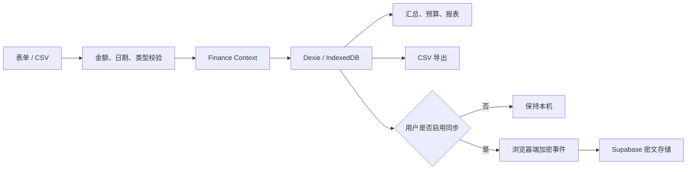

# 零钱簿 · 阿砚项目说明

## 一、产品目标

零钱簿面向希望长期管理日常收支的中文用户。产品优先保证账目留在用户手中、金额和统计可信、离线仍能使用，再考虑跨设备便利和视觉细节。

阿砚是产品中的水墨砚貅账灵。它帮助用户读懂自己的账本，但不评价消费、不制造焦虑、不提供专业投资建议。

## 二、核心用户任务

1. 快速记录一笔收入或支出。
2. 查看本月花了多少、还剩多少、主要花在哪里。
3. 给支出分类设定预算并观察进度。
4. 用报表复盘最近数月的收支变化。
5. 通过 CSV 备份、迁移或核对数据。
6. 在用户主动选择时，让自己的多个设备同步同一本账。

## 三、产品边界

### 必须做到

- 中文、人民币、本地日历语义。
- 金额以整数分计算和持久化。
- 未配置云服务时完整本机可用。
- CSV 导入先预检、后确认。
- 数据删除、清空和配对操作有清晰中文提示。
- 桌面与至少 375px 移动视口可用。

### 当前不承诺

- 银行卡或支付平台自动抓账。
- 投资收益分析、资产配置或专业理财建议。
- 服务端读取明文账目。
- 未经用户确认的自动云备份。
- 用清库替代 IndexedDB schema 迁移。

## 四、数据流

## 五、模块职责

| 模块 | 责任 |
| :--- | :--- |
| `src/lib/finance.ts` | 金额转换、格式化、月度汇总和月份序列 |
| `src/lib/csv.ts` | CSV 解析、预检、重复识别和导出 |
| `src/lib/spirit.ts` | 阿砚的本机问答和称呼提取 |
| `src/data/db.ts` | IndexedDB schema 与仓储访问 |
| `src/context/FinanceContext.tsx` | 本机数据、页面状态和同步协调 |
| `src/sync/crypto.ts` | 配对材料和同步事件加解密 |
| `src/sync/service.ts` | Supabase 身份、房间、队列和实时同步 |
| `supabase/schema.sql` | 远端表、函数、权限与 RLS |

## 六、质量原则

- 财务正确性优先于动画、图表和代码精简。
- 同步失败不得阻塞本机写入或让已确认数据消失。
- 用户可恢复的错误需要面向用户说明，日志不得包含账目和密钥。
- 改动源逻辑并补回归测试，不修改 `dist/` 掩盖问题。
- 当前事实以 `MEMORY/事实.md` 和当次命令结果为准。

最后更新：2026-08-09
